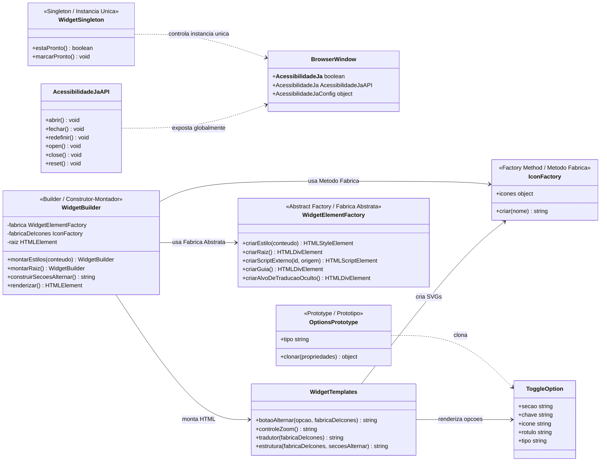
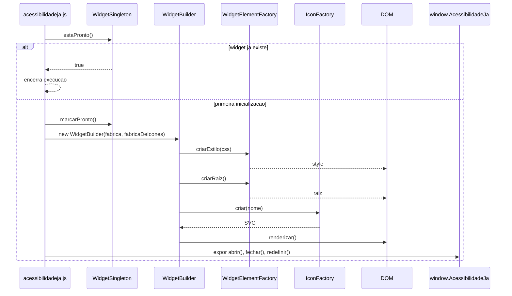

# UML - GoFs Criacionais no AcessibilidadeJa

Este diagrama mostra onde os padroes GoF criacionais foram aplicados no widget `public/widget/acessibilidadeja.js`.

| Nome original | Nome em portugues usado no projeto |
| --- | --- |
| Singleton | Instancia Unica |
| Factory Method | Metodo Fabrica |
| Prototype | Prototipo |
| Abstract Factory | Fabrica Abstrata |
| Builder | Construtor / Montador |

## Relacao com os GoFs Criacionais

| Padrao em portugues | Nome GoF original | Elemento no projeto | Responsabilidade |
| --- | --- | --- | --- |
| Instancia Unica | Singleton | `WidgetSingleton` | Garante que o widget seja inicializado apenas uma vez na pagina. |
| Metodo Fabrica | Factory Method | `IconFactory.criar(nome)` | Cria o SVG correto a partir do nome do icone. |
| Prototipo | Prototype | `OptionsPrototype.clonar(propriedades)` | Cria novas opcoes do menu copiando uma estrutura base. |
| Fabrica Abstrata | Abstract Factory | `WidgetElementFactory` | Centraliza a criacao de elementos relacionados ao widget. |
| Construtor / Montador | Builder | `WidgetBuilder` | Monta o widget em etapas: estilos, raiz, secoes e interface final. |

## Fluxo Resumido

